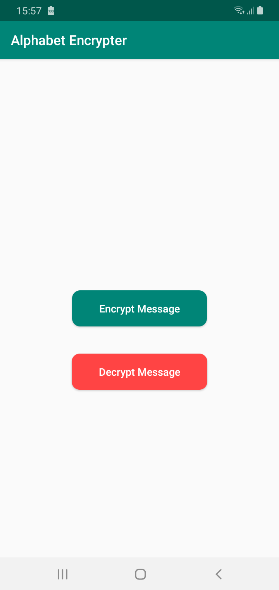
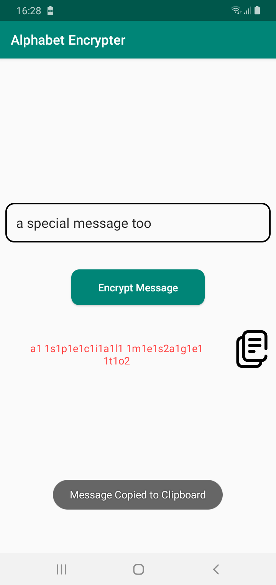
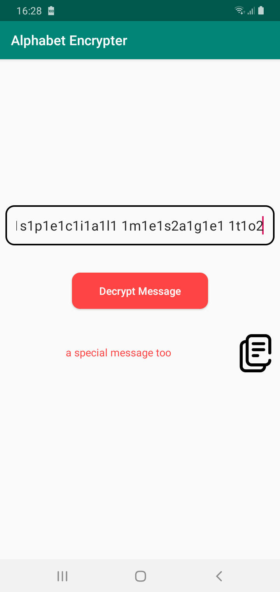

Alphabet Encrypter
------

Example message is "a special message too", then encrypted message will be "a1 1s1p1e1c1i1a1l1 1m1e1s2a1g1e1 1t1o2".

Screenshot
=====

<table>
  <tr>
    <td>
      
    </td>
    <td>
      
    </td>
    <td>
      
    </td>
  </tr>
</table>